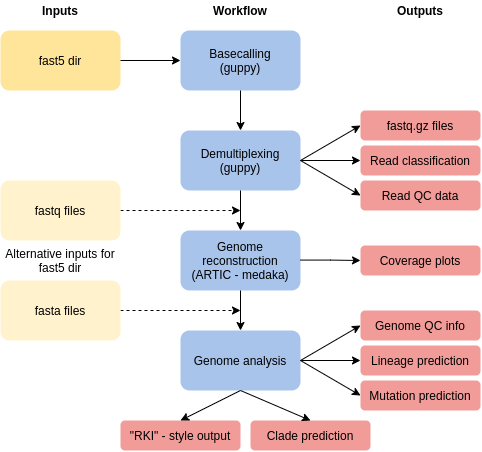

**poreCov | nCov19 Workflow for nanopore sequencing data**   
===


[](https://twitter.com/gcloudChris) 

* by Christian Brandt

> **Featured here:**
> Hufsky, F.; Lamkiewicz, K.; Almeida, A.; Aouacheria, A.; Arighi, C.; Bateman, A.; Baumbach, J.; Beerenwinkel, N.; Brandt, C.; Cacciabue, M.; Chuguransky, S.; Drechsel, O.; Finn, R.D.; Fritz, A.; Fuchs, S.; Hattab, G.; Hauschild, A.; Heider, D.; Hoffmann, M.; Hölzer, M.; Hoops, S.; Kaderali, L.; Kalvari, I.; von Kleist, M.; Kmiecinski, R.; Kühnert, D.; Lasso, G.; Libin, P.; List, M.; Löchel, H.F.; Martin, M.J.; Martin, R.; Matschinske, J.; McHardy, A.C.; Mendes, P.; Mistry, J.; Navratil, V.; Nawrocki, E.; O'Toole, Á.N.; Palacios-Ontiveros, N.; Petrov, A.I.; Rangel-Piñeros, G.; Redaschi, N.; Reimering, S.; Reinert, K.; Reyes, A.; Richardson, L.; Robertson, D.L.; Sadegh, S.; Singer, J.B.; Theys, K.; Upton, C.; Welzel, M.; Williams, L.; Marz, M. Computational Strategies to Combat COVID-19: Useful Tools to Accelerate SARS-CoV-2 and Coronavirus Research. Preprints 2020, 2020050376 (doi: 10.20944/preprints202005.0376.v1).

## What is this Repo?

* poreCov is a general nCov analysis workflows using nanopore data with the ARTIC and Augur tools
    * ARTIC protocol and reference from [here](https://artic.network/ncov-2019)
* a few handy QC and plots are included to decrease post analytic "downtime"
    * e.g. was the PCR coverage on each position enough?

Table of Contents
=================

* [Installation](#Installation)
* [Run poreCov](#Run-poreCov)
    * [Example commands](#Example-commands)
    * [Help](#Help)
* [Workflow](#Workflow)
* [References and Metadata for tree construction](#References-and-Metadata-for-tree-construction)
    * [References](#References)
    * [Metadata](#Metadata)
* [Literature to cite](#Literature-to-cite)


# Installation

**Dependencies**

* one of these:
>   * docker
>   * singularity
>   * conda (NOT YET IMPLEMENTED)
>   * a local guppy installation or a docker with gpu support
>      * not needed if you use fastq or fasta as input
>   * nextflow + java runtime 

**Installation links**

* Docker installation [here](https://docs.docker.com/v17.09/engine/installation/linux/docker-ce/ubuntu/#install-docker-ce)
    * add docker to your User group via `sudo usermod -a -G docker $USER`
* Singularity installation [here](https://singularity.lbl.gov/install-linux)
    * need
* Conda installation [here](https://docs.conda.io/projects/conda/en/latest/user-guide/install/)
    * not yet implemented
* Nextflow via: `curl -s https://get.nextflow.io | bash`
    * a java runtime is needed
    * move `nextflow` executable to a path location

# Run poreCov

## Example commands

```bash
# just do basecalling and assembly with QC / lineage:
nextflow run replikation/poreCov --dir fast5/ \
    --cores 32 -profile local,docker

# use fastq files with workflow provided references for tree construction
nextflow run replikation/poreCov  \
    --fastq 'samples/samplenumber_*.fastq.gz' --metadata metadata.csv \
    --cores 32  -profile local,docker

# build a tree by using your own references
nextflow run replikation/poreCov --fasta 'nCov-genomes/*.fasta' \
    --metadata metadata.csv --references references_multifasta.fa \
    --cores 32  -profile local,docker
```

## Help

* workflows and inputs are described here:

```bash
nextflow run replikation/poreCov --help
# or git clone and
./poreCov.nf --help
```

# Workflow

* poreCov was coded with "easy to use" in mind, while staying flexible
* the default use case is fast5 raw-data to "results"
* however by providing fastq or fasta instead poreCov skips over the corresponding steps
* provide `--metadata` to start the tree construction



# References and Metadata for tree construction
## References
* by default the nCov Workflow uses a few hundred nCov strains automatically to build the tree
    * these files are from ENA
    * metadata for this is automatically added
* this behaviour can be "replaced" by providing a multifasta reference file via `--references`
* please make sure that these fastaheader dont contain "strange" symbols like `" '  | / \ :`
    * this causes issues in some of the tools used here

## Metadata
* for tree constructions `--metadata file.tsv` is mandatory
* style of the metadata: 
    * tab separated: `\t`
    * header: `strain   time    location`
    * one sample per line
    * **strain**: 
        * name of the fasta or fastq file without any suffix (`--fasta` or `--fastq`)
        * barcode01 barcode02 etc. for fast5 data inside a directory (`--dir`)
        * fasta header name (without >) for the multifasta reference (`--reference`)
    * **location** can be set to "unknown"
    * **date** format is `YYYY-MM-DD` or `YYYY-MM`
* example:

```csv
strain	country	date
LC528232-unknown-2020-02-10	unknown	2020-02-10
LC528233-unknown-2020-02-10	unknown	2020-02-10
LC534418-Japan-2020-02-14	Japan	2020-02-14
LC534419-Japan-2020-03-09	Japan	2020-03-09
MN908947-China-Dec-2019	China	2019-12
barcode01   Germany 2020-01-01
```

# Literature to cite
For citing etc. check out these programs used for poreCov:
* [nextflow](https://www.nextflow.io/index.html)
* [artic protocoll](https://artic.network/ncov-2019/ncov2019-bioinformatics-sop.html)
* [augur](https://github.com/nextstrain/augur)
* [pangolin](https://github.com/hCoV-2019/pangolin)
    * [iqtree](http://www.iqtree.org/#download)
    * [mafft](https://mafft.cbrc.jp/alignment/software/)
    * [snakemake](https://snakemake.readthedocs.io/en/stable/index.html)
* [toytree](https://github.com/eaton-lab/toytree)
* [medaka](https://github.com/nanoporetech/medaka)
