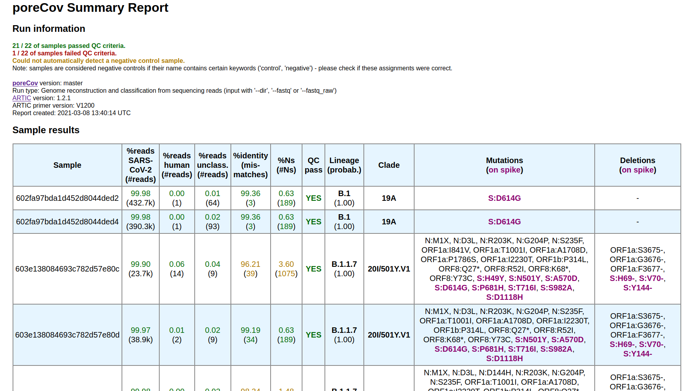

<p align="center">
  
</p>

**poreCov | SARS-CoV-2 Workflow for nanopore sequencing data**   
===


[](https://doi.org/10.5281/zenodo.4153509)

[](https://twitter.com/gcloudChris) 


> **Featured here:**
> Franziska Hufsky, Kevin Lamkiewicz, Alexandre Almeida, Abdel Aouacheria, Cecilia Arighi, Alex Bateman, Jan Baumbach, Niko Beerenwinkel, Christian Brandt, Marco Cacciabue, Sara Chuguransky, Oliver Drechsel, Robert D Finn, Adrian Fritz, Stephan Fuchs, Georges Hattab, Anne-Christin Hauschild, Dominik Heider, Marie Hoffmann, Martin Hölzer, Stefan Hoops, Lars Kaderali, Ioanna Kalvari, Max von Kleist, Renó Kmiecinski, Denise Kühnert, Gorka Lasso, Pieter Libin, Markus List, Hannah F Löchel, Maria J Martin, Roman Martin, Julian Matschinske, Alice C McHardy, Pedro Mendes, Jaina Mistry, Vincent Navratil, Eric P Nawrocki, Áine Niamh O’Toole, Nancy Ontiveros-Palacios, Anton I Petrov, Guillermo Rangel-Pineros, Nicole Redaschi, Susanne Reimering, Knut Reinert, Alejandro Reyes, Lorna Richardson, David L Robertson, Sepideh Sadegh, Joshua B Singer, Kristof Theys, Chris Upton, Marius Welzel, Lowri Williams, Manja Marz, Computational strategies to combat COVID-19: useful tools to accelerate SARS-CoV-2 and coronavirus research, Briefings in Bioinformatics, bbaa232, https://doi.org/10.1093/bib/bbaa232.

## What is this Repo?

* poreCov is a SARS-CoV-2 analysis workflow for nanopore data (via the [ARTIC protocol](https://artic.network/ncov-2019)) or SARS-CoV-2 genomes (fasta)
* the workflow is pre configured to simplify [data anlysis](https://htmlpreview.github.io/?https://github.com/replikation/poreCov/blob/master/data/figures/index.html): 
<p align="left">
    <a href="https://htmlpreview.github.io/?https://github.com/replikation/poreCov/blob/master/data/figures/index.html">
        
</p>

Table of Contents
=================

* [1. Quick Setup (ubuntu)](#1.-Quick-Setup-(ubuntu))
    * [1.1 Nextflow](#1.1-Nextflow-(the-workflow-manager))
    * [1.2 Container](#1.2-Container-(choose-one---they-manage-all-the-tools))
    * [1.3 Basecalling (optional)](#1.3-Basecalling-(optional))
* [2. run poreCov](#2.-run-poreCov)
    * [2.1 test run](#2.1-test-run)
    * [2.2 quick run examples](#2.2-quick-run-examples)
    * [2.3 Extended Usage](#2.3-Extended-Usage)
* [3. Quality Metrics (default)](#3.-Quality-Metrics-(default))
* [4. Workflow](#4.-Workflow)
* [5. Literature / References to cite](#5.-Literature-/-References-to-cite)
* [6. Troubleshooting](#6.-Troubleshooting)

# 1. Quick Setup (ubuntu)
## 1.1 Nextflow (the workflow manager)
* poreCov needs [nextflow](https://www.nextflow.io/index.html) and java run time (default-jre)
    * install java run time via:  `sudo apt install -y default-jre`
    * install nextflow via:  `curl -s https://get.nextflow.io | bash && sudo mv nextflow /bin && sudo chmod 770 /bin/nextflow`
## 1.2 Container (choose one - they manage all the tools)
### Docker
* installation [here](https://docs.docker.com/v17.09/engine/installation/linux/docker-ce/ubuntu/#install-docker-ce) (recommended), alternatively via: `sudo apt install -y docker`
* add docker to the user: `sudo usermod -a -G docker $USER`
### Singularity
* Singularity installation [here](https://singularity.lbl.gov/install-linux)
* if you cant use docker
### Conda (not recommended)
* Conda installation [here](https://docs.conda.io/projects/conda/en/latest/user-guide/install/)
* install nextflow and singularity via conda (not cluster compatible) - and use the singularity profile
## 1.3 Basecalling (optional)
* only important if you want to do basecalling via GPU with the workflow:
    * local guppy installation (see oxford nanopore installation guide)
    * or: install nvidia docker tool kit
    * or: singularity (with --nv support)


# 2. run poreCov
## 2.1 test run
* validate your installation via test data:

```bash
# for a docker installation
nextflow run replikation/poreCov -profile test_fastq,local,docker -r 0.8.0

# or for singularity or conda installation
nextflow run replikation/poreCov -profile test_fastq,local,singularity -r 0.8.0
```

## 2.2 quick run examples

* poreCov with basecalling and docker
    * `--update` tryies to force the most recent lineage release version (optional)
    * `-r 0.8.0` specifies the workflow release from [here](https://github.com/replikation/poreCov/releases)
```bash
nextflow run replikation/poreCov --fast5 fast5/ -r 0.8.0 \
    --cores 6 -profile local,docker --update 
```

* poreCov with a basecalled fastq directory 

```bash
nextflow run replikation/poreCov --fastq_pass 'fastq_pass/' -r 0.8.0 \
    --cores 32  -profile local,docker
```

* poreCov with basecalling and renaming of barcodes based on `sample_names.csv`

```bash
# rename barcodes automatically by providing an input file, also using another primer scheme
nextflow run replikation/poreCov --fast5 fast5_dir/ --samples sample_names.csv \
   --primerV V1200 --output results -profile local,docker
```

## 2.3 Extended Usage
* see also `nextflow run replikation/poreCov --help -r 0.8.0`
### Version control
* poreCov supports version control via `-r` this way you can run everything reproducable (e.g. `-r 0.8.0`)
* poreCov relases are listed [here](https://github.com/replikation/poreCov/releases)
* add `-r <version>` to a poreCoV run to activate this
* run `nextflow pull replikation/poreCov` to install updates
   * if you have issues during update try `rm -rf ~/.nextflow` and then `nextflow pull replikation/poreCov`
   * this removes old files and downloads everything new

### Important input flags (choose on)
* these are the flags to get "data" into the workflow
   * `--fast5 fast5_dir/`  for fast5 directory input
   * `--fastq_pass fastq_dir/`  directory with basecalled data (contains "barcode01" etc. directories)
   * `--fastq "sample*.fastq.gz"` alternative fastq input (one sample per file)
   * `--fasta "*genomes.fasta"`  SARS-CoV-2 genomes as fasta 

### Sample sheet
* barcodes can be automatically renamed via `--samples sample_names.csv`
* example comma separated file (dont replace the header)
  * `_id` = sample name
  * `Status` = barcode number which should be renamed

```csv
_id,Status
Sample_2021,barcode01
2ndSample,BC02
```

# 3. Quality Metrics (default)

* Regions with coverage of 20 or less are masked ("N")
* Genomequality is compared to NC_045512.2
    * Genome quality assessment is based on [RKIBioinformaticsPipelines/president](https://gitlab.com/RKIBioinformaticsPipelines/president)
        * also prepares csv and fasta for upload via DESH portal
* Pangolin lineages are determined
* nextstrain clades are determined including mutation infos
* reads are classified to human and SARS-CoV-2 to check for possible contamination and sample prep issues


# 4. Workflow

* poreCov was coded with "easy to use" in mind, while staying flexible
* therefore we provide a few input types which adjusts the workflow automatically (see image below)
  * fast5 raw data, fastq files (one sample per file), fastq_pass (the basecalling output) or fasta (supports multifastas)
* primer schemes for ARTIC can be V1, V2, V3(default) or V1200 (the 1200bp amplicon ones)

<p align="left">
  
</p>


# 5. Literature / References to cite
For citing etc. check out these programs used for poreCov:
* [artic protocol](https://artic.network/ncov-2019/ncov2019-bioinformatics-sop.html)
* [kraken2](https://genomebiology.biomedcentral.com/articles/10.1186/s13059-019-1891-0)
* [krona](https://bmcbioinformatics.biomedcentral.com/articles/10.1186/1471-2105-12-385)
* [medaka](https://github.com/nanoporetech/medaka)
* [minimap2](https://github.com/lh3/minimap2)
* [nextclade](https://clades.nextstrain.org/)
* [nextflow](https://www.nextflow.io/index.html)
* [pangolin](https://github.com/hCoV-2019/pangolin)
* [president](https://gitlab.com/RKIBioinformaticsPipelines/president)

# 6. Troubleshooting
* Collection of some helpful infos

## Singularity
* Singularity needs additional option flags to run like `--userns` [Solution on how to pass singularity commands to poreCov](https://github.com/replikation/poreCov/issues/101#issuecomment-825807042)
